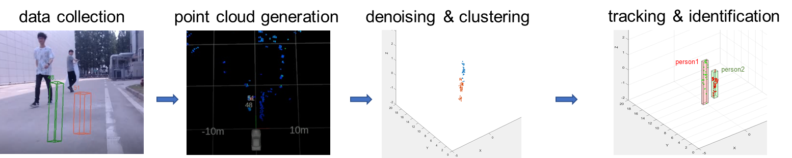
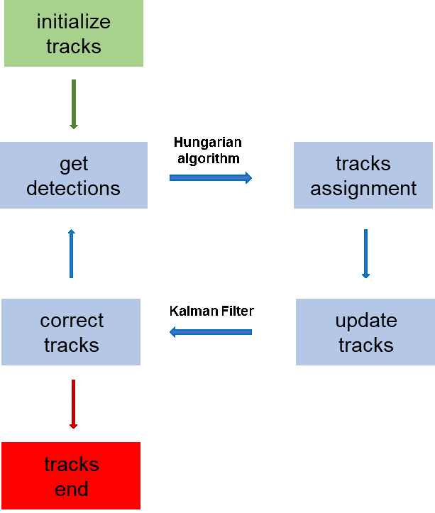
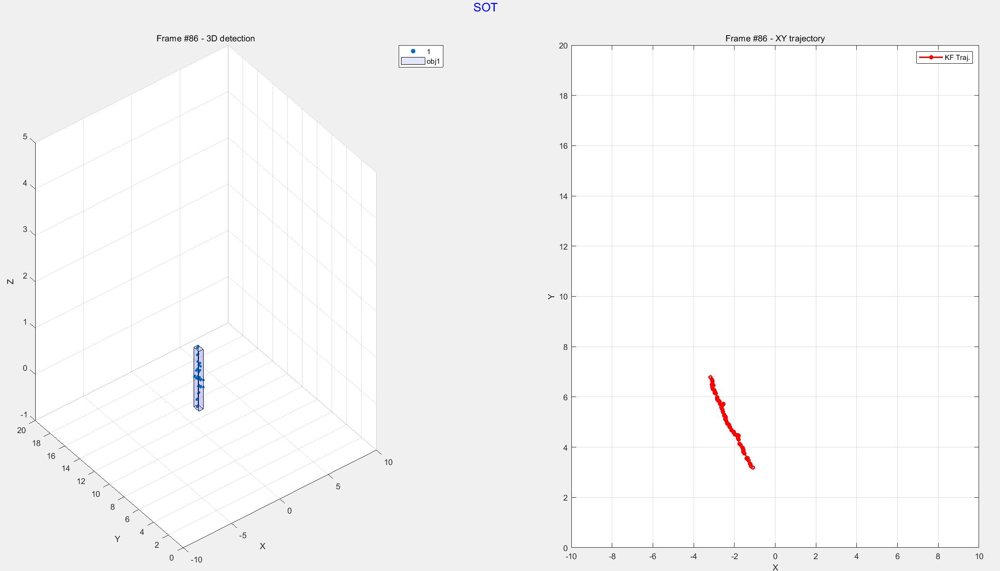
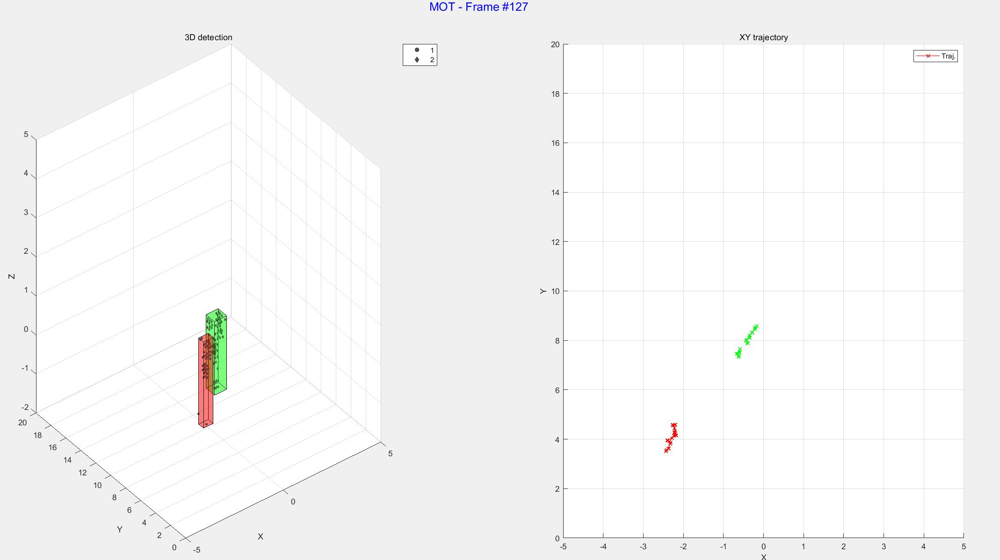

# mmWave_radar_tracking
object tracking based on millimeter wave radar data

\* Author: [Zhihong Zhang](https://github.com/dawnlh)

## Introduction

Object tracking based on millimeter wave radar data with Kalman Filter algorithm. 

### Flow chart for the whole project

### Flow chart for the object tracking module

## Result demo

## Note

- In multiple object tracking, when objects have overlapping, mistakes may occur. This problem can perhaps be solved by using a more robust `detectionToTrackAssignment.m` function. Specifically, we can take other statistic features into account when calculating the cost in `detectionToTrackAssignment.m` function. Currently, only position and  speed are considerer.
- The performance of the implemented algorithm is very dependent on parameter tuning, especially the parameters of DBSCAN and the tracking module (like parameters in `detectionToTrackAssignment.m` and `updateTrackStates.m`).
- Tips to improve the performance
  - A more sophisticated **denoising algorithm.** Current `point_cloud_denoise.m` only removes the static points and out-of-range points, the "real" noise is not filtered. A better denoising algorithm may consider the spatial-temporal information between adjacent frames and adjacent regions.
  - A more sophisticated **cluster algorithm**, which can automatically figure out different objects in tough cases like overlapping.
  - A more sophisticated **tracking algorithm and strategy**, which take more information into consideration and realize better performance.
  - Optimize the code to **lower the computation cost** and speed up the running speed.

## Reference

- P. Zhao *et al.*, “mID: Tracking and Identifying People with Millimeter Wave Radar,” in *2019 15th International Conference on Distributed Computing in Sensor Systems (DCOSS)*, Santorini Island, Greece, May 2019, pp. 33–40. doi: [10.1109/DCOSS.2019.00028](https://doi.org/10.1109/DCOSS.2019.00028).
- [MATLAB: Motion-Based Multiple Object Tracking](https://ww2.mathworks.cn/help/vision/ug/motion-based-multiple-object-tracking.html)
- [MATLAB: Use Kalman Filter for Object Tracking](https://ww2.mathworks.cn/help/vision/ug/using-kalman-filter-for-object-tracking.html)
